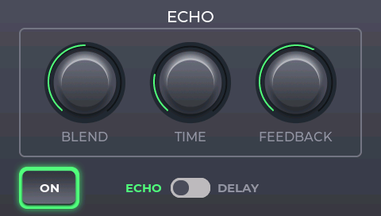

# Digital Multi Effect

A concept of digital multi-effect for guitar running on STM32F746-DISCO board

## Overview

Device captures audio signal from line-in jack (left channel), then processes audio samples according to selected effect and finally outputs processed audio to line-out jack. User controls device by touchscreen. It is possible to add multiple effects to signal chain. Several basic guitar effects are implemented:
- tremolo
- echo/delay
- chorus
- reverb
- overdrive
- speaker cabinet emulator
- vocoder (needs additional signal input as modulator, which is on the right channel of line-in)

Effects order (in signal chain) can be changed through settings menu and each effect can be enabled/disabled separately. Changing between effects is done by left/right *swipe* gesture. Settings screen can be accessed by *swipe down* gesture.

Audio quality is set to 24bit 48kHz. Audio latency is determined by the size of audio buffer, which by default is 128 samples that gives around 6ms in-out delay.

## Demo
https://youtu.be/xXm61wA0C68?feature=shared

## How to build

Project was created using **Eclipse IDE for Embedded C/C++ Developers**

## How to add new effect

Here is a brief description of how to add new effect to the system:

1. Define new effect ID, name, its attributes and controls in **app/model/effect_features.hpp**. Do not forget to add new effect attributes to the **effect_specific_attributes** variant at the end.
2. Add new effect module (.cpp/.hpp pair) to the **app/model/new_effect_name** location. Write new effect class that inherits from base **effect** class. Look at other effects implementation as a guideline.
3. Go to **app/model/effect_processor.hpp** module and add new effect controls variant to the event **set_effect_controls**. Add another **set_controls** method overload to the **effect_processor** class. In the source file, include header of new effect and add new entry to the **effect_factory** map. Define **set_controls** method.
4. Go to the **app/view/lcd_view/screens** and create new screen for the effect. This is the most complicated step and would take a lot of writting to describe it in detail here :(. You can use Squareline Studio tool to easily create screen without writting code. Another way is to look at existing screens implementation and take it as a guideline. Go to the **app/view/lcd_view/** and write event handling code for new screen in **ui_events.cpp** & **ui.c** source files.
5. Go to **app/view/lcd_view/lcd_view.hpp** module and add new effect controls to the **effect_controls_changed** event. Add another **set_effect_attr** method overload to the **lcd_view** class and define it in the source file. Also, in method **change_effect_screen** add new case for handling new effect screen.

After completing these steps it should be possible to compile the project. However this instruction is not very detailed so there may be compilation errors if something is missing. If so, follow the compiler error messages.
