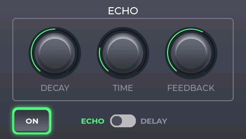

# Digital Multi Effect

A concept of digital multi-effect for guitar running on STM32F746-DISCO board

## Overview

Device captures audio signal from line-in jack (left channel), then processes audio samples according to selected effect and finally outputs processed audio to line-out jack. User controls device by touchscreen. It is possible to add multiple effects to signal chain. Currently six basic guitar effects are implemented:
- tremolo
- echo/delay
- chorus
- reverb
- overdrive
- speaker cabinet emulator

Effects order (in signal chain) can be changed through settings menu and each effect can be enabled/disabled separately. Changing between effects is done by left/right 'swipe' gesture. Settings screen can be accessed by 'swipe down' gesture.

Audio quality is set to 24bit 48kHz. Audio latency is determined by size of audio buffer, for now it is around 6ms.

## Demo
https://youtu.be/xXm61wA0C68?feature=shared

## How to build

Project was created using 'Eclipse IDE for Embedded C/C++ Developers'
